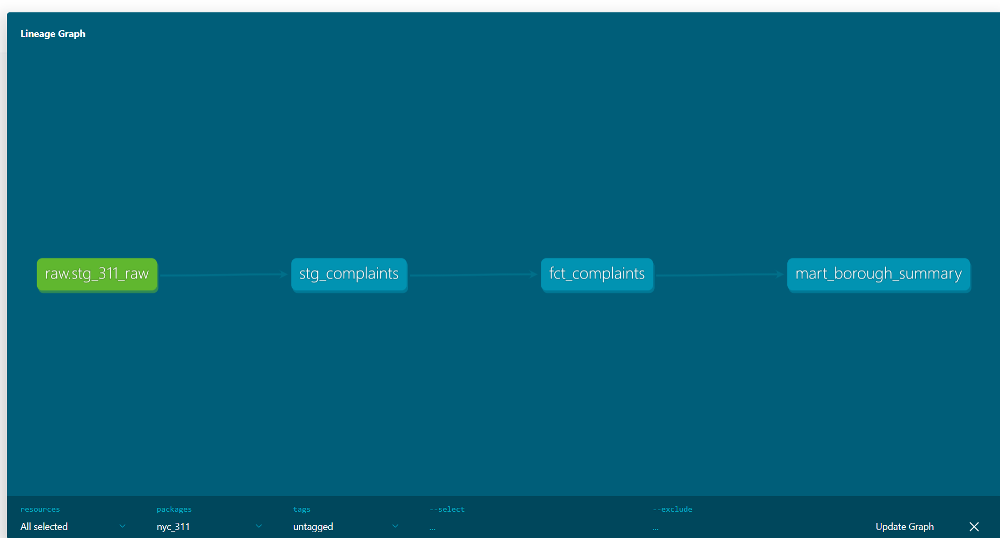

# NYC 311 Service Request Analytics Pipeline

> End-to-end modern data stack pipeline ingesting 4.4M NYC 311 complaints into Snowflake, transformed with dbt, and exposed as analytics-ready mart tables.


---

## Lineage Graph



---

## Architecture

The pipeline follows a medallion architecture — raw data is loaded once and progressively refined through three layers.

| Layer | Tool | Table / Model | What happens here |
|-------|------|---------------|-------------------|
| **Bronze** | Python | `stg_311_raw` | Raw CSV (4.4M rows) bulk-loaded into Snowflake via `snowflake-connector-python` |
| **Silver** | dbt staging | `stg_complaints` | Types cast, nulls handled, columns renamed, corrupted timestamps repaired with `TRY_TO_TIMESTAMP` |
| **Gold** | dbt marts | `fct_complaints`, `mart_borough_summary` | SLA resolution times calculated, borough-level aggregations, breach-rate metrics |

```
ingestion/load_to_snowflake.py
        │
        ▼
  Snowflake: RAW.stg_311_raw
        │
        ▼ dbt staging
  Snowflake: STAGING.stg_complaints
        │
        ├──▶ MARTS.fct_complaints
        └──▶ MARTS.mart_borough_summary
```

---

## Tech Stack

| Component | Technology |
|-----------|-----------|
| Cloud warehouse | Snowflake |
| Transformation | dbt Core |
| Ingestion | Python + snowflake-connector-python |
| CI / CD | GitHub Actions |
| Data source | [NYC Open Data — 311 Service Requests](https://data.cityofnewyork.us/Social-Services/311-Service-Requests-from-2010-to-Present/erm2-nwe9) |

---

## Key Findings

These metrics surface from `mart_borough_summary` and `fct_complaints`.

- **Manhattan resolves complaints in 129.6 days on average vs. 8.0 days in the Bronx** — a 16x disparity driven by long-running noise and housing complaints concentrated in Manhattan.
- **Illegal Parking is the #1 complaint type** with 709K records and an average resolution time of just 0.2 days, indicating a highly efficient enforcement workflow.
- **Unspecified borough has a 22.5% SLA breach rate** compared to 5–7% for named boroughs, suggesting citywide or agency-routed complaints lack clear ownership.

---

## Data Quality

Real-world 311 data is messy. Every issue below was caught, documented, and resolved in the pipeline.

| Issue | Root cause | Fix |
|-------|-----------|-----|
| 5,684 null boroughs (0.13% of dataset) | Complaints filed without a location or routed citywide | Coalesced to `'Unspecified'`; documented as a valid category, not dropped |
| Corrupted timestamps (`P{` instead of `PM`) | Upstream data-entry error in source system | `TRY_TO_TIMESTAMP` returns `NULL` gracefully; flagged in staging |
| Undocumented `status` values | Source schema evolved without notice | Discovered via `dbt test` accepted-values checks; values added to `schema.yml` allowlist after investigation |

---

## Repo Structure

```
nyc-311-analytics/
├── .github/
│   └── workflows/
│       └── dbt_ci.yml           # CI: runs dbt build + test on push
├── ingestion/
│   ├── load_to_snowflake.py     # Bulk-loads raw CSV into Snowflake
│   └── 311_data.csv             # Source extract (gitignored in prod)
├── nyc_311/                     # dbt project root
│   ├── models/
│   │   ├── staging/
│   │   │   ├── sources.yml      # Snowflake source declaration
│   │   │   ├── schema.yml       # Column tests & documentation
│   │   │   └── stg_complaints.sql
│   │   └── marts/
│   │       ├── fct_complaints.sql
│   │       └── mart_borough_summary.sql
│   ├── macros/
│   ├── seeds/
│   ├── snapshots/
│   ├── tests/
│   └── dbt_project.yml
├── scripts/
│   ├── snowflake_setup.sql      # Warehouse / database / role setup
│   └── snowflake_features.sql   # Exploratory SQL queries
├── lineage.png                  # dbt DAG screenshot
├── findings.md                  # Analytical findings write-up
└── README.md
```

---

## Setup

### Prerequisites

- Python 3.9+
- A Snowflake account with a warehouse and database
- dbt Core (`pip install dbt-snowflake`)

### 1. Clone the repo

```bash
git clone https://github.com/neehanayak/nyc-311-analytics.git
cd nyc-311-analytics
```

### 2. Install dependencies

```bash
pip install snowflake-connector-python python-dotenv
pip install dbt-snowflake
```

### 3. Configure environment variables

Copy the example below into a `.env` file at the project root and fill in your Snowflake credentials.

```dotenv
SNOWFLAKE_ACCOUNT=your_account_identifier
SNOWFLAKE_USER=your_username
SNOWFLAKE_PASSWORD=your_password
SNOWFLAKE_WAREHOUSE=your_warehouse
SNOWFLAKE_DATABASE=your_database
SNOWFLAKE_SCHEMA=RAW
SNOWFLAKE_ROLE=your_role
```

Also configure `nyc_311/profiles.yml` (or `~/.dbt/profiles.yml`) to point at the same Snowflake environment.

### 4. Set up Snowflake objects

```sql
-- Run scripts/snowflake_setup.sql in a Snowflake worksheet
-- Creates the database, schemas, warehouse, and role grants
```

### 5. Run ingestion

```bash
python ingestion/load_to_snowflake.py
```

This loads `311_data.csv` into `RAW.stg_311_raw` (4.4M rows, ~2–5 min depending on warehouse size).

### 6. Run dbt

```bash
cd nyc_311

# Build all models
dbt run

# Run all tests (uniqueness, not-null, accepted values)
dbt test

# Build + test in one command
dbt build
```

### 7. Explore results

Query the mart tables directly in Snowflake:

```sql
SELECT * FROM MARTS.mart_borough_summary ORDER BY avg_resolution_days DESC;
SELECT complaint_type, COUNT(*) FROM MARTS.fct_complaints GROUP BY 1 ORDER BY 2 DESC LIMIT 10;
```

---

## CI / CD

GitHub Actions runs `dbt build` on every push to `main`. See `.github/workflows/dbt_ci.yml` for the full workflow. Snowflake credentials are stored as repository secrets.

---

## License

This project uses publicly available data from [NYC Open Data](https://opendata.cityofnewyork.us/) under the [NYC Open Data Terms of Use](https://opendata.cityofnewyork.us/overview/#termsofuse).
